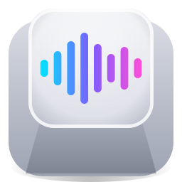
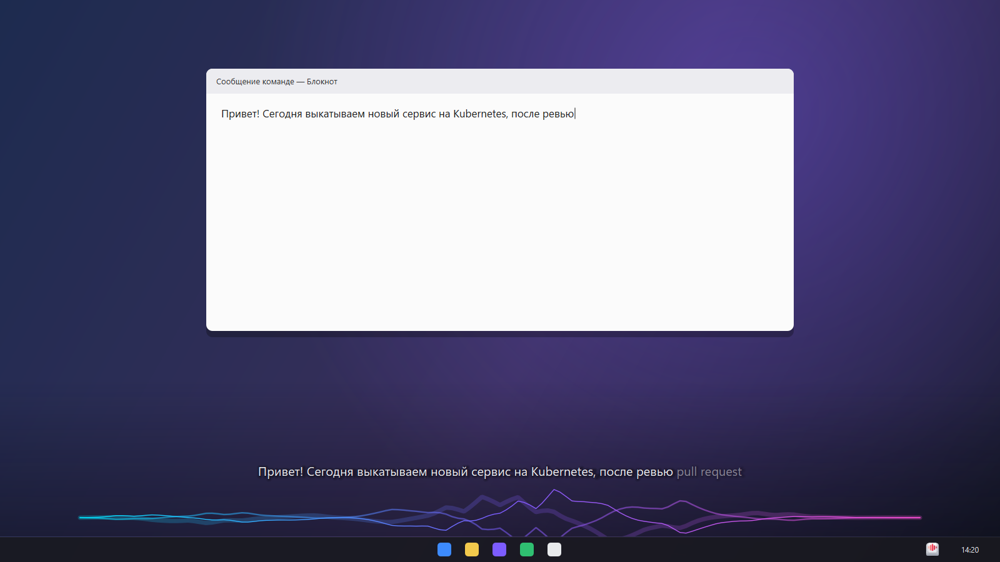
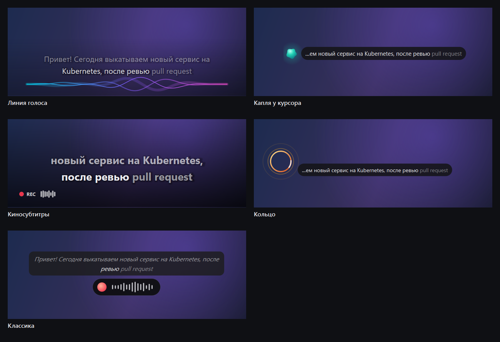
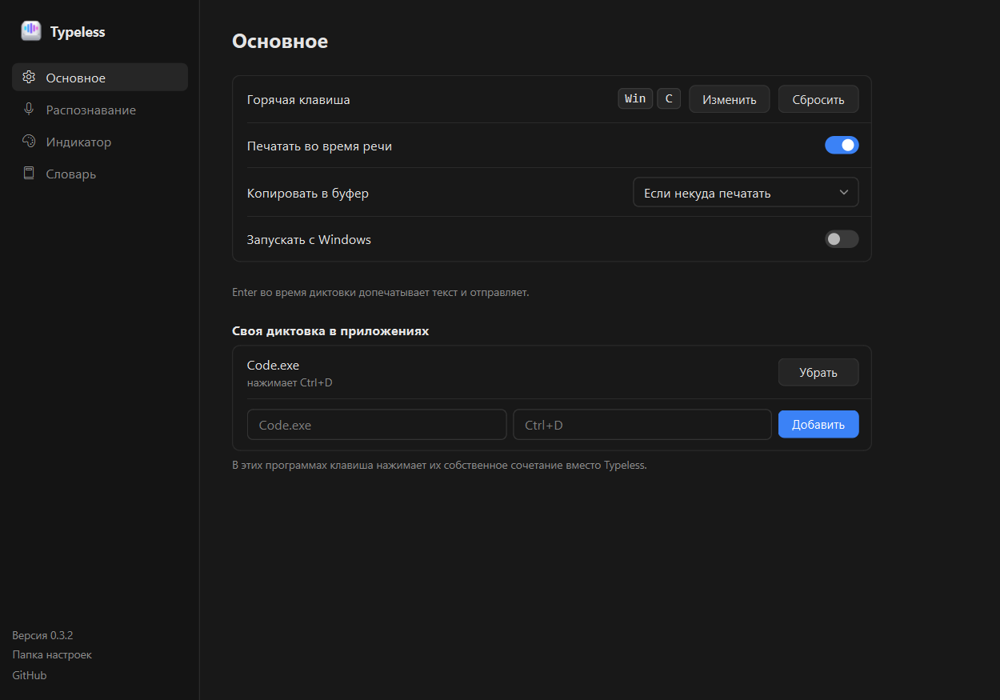
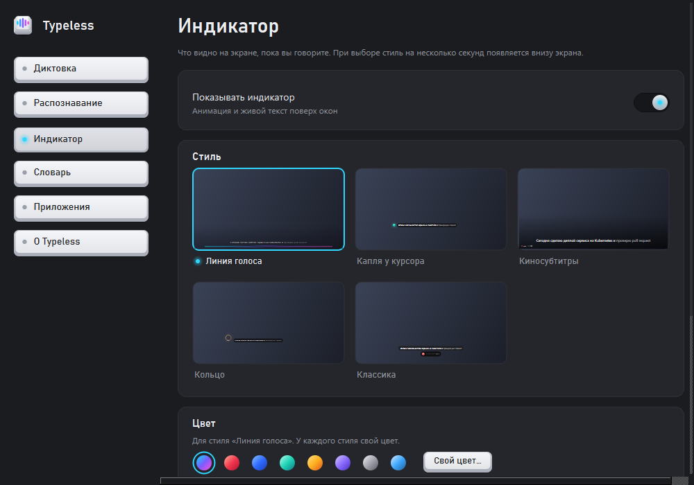
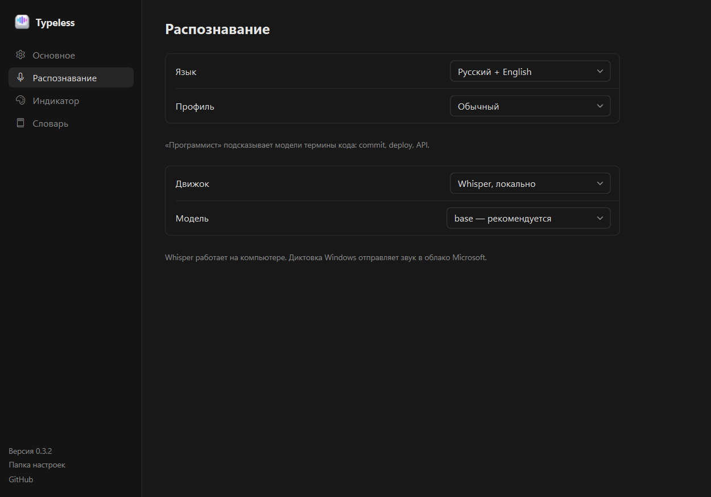
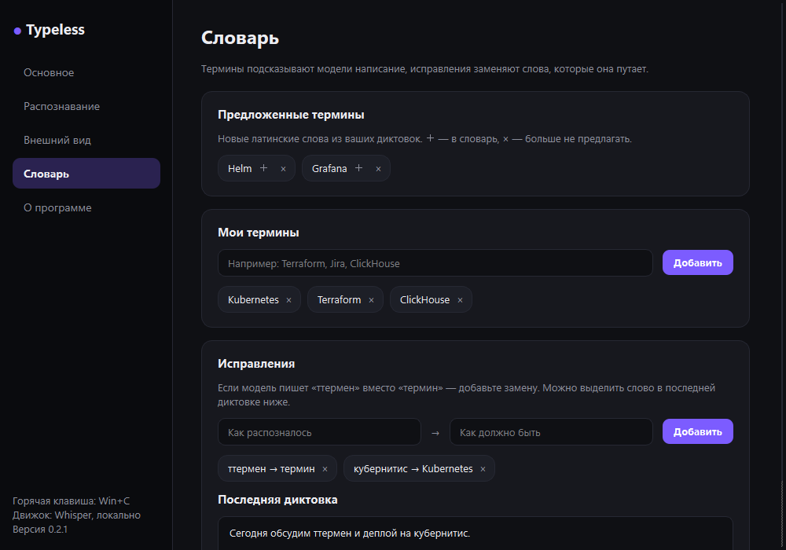

# Typeless



Голосовой ввод для Windows: нажимаете клавишу, говорите — и текст печатается в то поле, где стоит курсор, прямо во время речи. Распознавание работает локально на компьютере (NVIDIA Parakeet; на выбор также GigaAM и Whisper), бесплатно и без интернета.

- **Горячая клавиша** — по умолчанию Win+C (на Keychron K8 это клавиша микрофона), меняется в настройках. Copilot при этом не открывается.
- **Живой ввод** — слова появляются в поле с задержкой около полутора секунд, фраза дописывается сразу после паузы; Enter во время диктовки допечатывает текст и отправляет.
- **Не грузит компьютер** — детектор речи (Silero VAD) включает модель только пока вы говорите; в паузах нагрузка нулевая.
- **Русский с английскими терминами**, а также только русский, English, қазақша и автоопределение; профиль «Программист» для терминов кода.
- **Буфер обмена** — если курсор не в поле ввода, продиктованный текст копируется в буфер.

## Скриншоты

**Диктовка** — текст печатается в окне, внизу экрана индикатор «Линия голоса»:



Пять стилей индикатора, у каждого свой цвет:



Настройки — горячая клавиша, внешний вид и словарь:

<p>
  
  
</p>
<p>
  
  
</p>

> Скриншоты отрендерены на демо-данных скриптом `scripts/screenshots.py`.

## Установка

Запустите `TypelessSetup.exe`: установка в профиль пользователя, права администратора не нужны. После установки Typeless живёт в трее; ярлык в меню «Пуск» открывает настройки. При первом запуске скачивается модель распознавания (Parakeet — около 670 МБ, GigaAM — около 230 МБ, Whisper `base` — около 145 МБ).

## Запуск и сборка

Нужен Python 3.12.

```
conda create -p .venv python=3.12 -y              # или: py -3.12 -m venv .venv
.\.venv\python.exe -m pip install -r requirements.txt
.\.venv\python.exe -m typeless                    # запустить приложение (с консолью)
.\.venv\python.exe -m pytest                      # тесты
.\.venv\python.exe scripts\screenshots.py         # обновить скриншоты для README
powershell -ExecutionPolicy Bypass -File scripts\build.ps1   # установщик (dist\TypelessSetup.exe)
```

Для сборки установщика нужен [Inno Setup 6](https://jrsoftware.org/isinfo.php) (`winget install JRSoftware.InnoSetup`).

Настройки и лог хранятся в `%APPDATA%\typeless\`. Живой режим на WAV-файле (задержка, нагрузка на процессор, точность) — `scripts\simulate_stream.py sample.wav parakeet 1 sample.txt`; записать свой голос — `scripts\record_sample.py`.

## Структура

| Папка | Что внутри |
|---|---|
| `typeless/` | Ядро: горячая клавиша (хук клавиатуры), сессия диктовки, печать текста, буфер обмена, словарь и исправления. |
| `typeless/engines/` | Движки распознавания: общий потоковый цикл (VAD, фразы, подтверждение слов), Parakeet/GigaAM через onnx-asr, Whisper. |
| `typeless/overlay/` | Индикатор поверх экрана: общее окно, пять стилей, палитры. |
| `typeless/ui/` | Окно настроек: тема, страницы, виджеты. |
| `packaging/` | Иконка и скрипт Inno Setup. |
| `scripts/` | Сборка, скриншоты, замеры скорости, симуляция диктовки. |
| `tests/` | Тесты чистой логики: горячие клавиши, подтверждение слов, печать, словарь. |

## Документация

- `docs/superpowers/specs/` — исходная спецификация (историческая: часть решений изменилась в ходе работы).
- `docs/references/` — референсы интерфейса, с которых начинался дизайн.

## Ограничения

- В окна, запущенные от администратора, Windows не пропускает ввод от обычного процесса.
- Parakeet и GigaAM не принимают подсказок, поэтому словарь у них работает как автоисправление близких написаний (ClickHourse → ClickHouse), а выбор языка влияет только на Whisper.
- Казахский распознаёт только Whisper, и на `base` слабо — лучше `small`.
- Позицию текстового курсора («Капля у курсора») сообщают не все приложения; тогда капля появляется у мыши.

## Конфиденциальность

- Аудио обрабатывается на компьютере и никуда не отправляется.
- В сеть приложение ходит только чтобы один раз скачать модель распознавания с Hugging Face.
- Рекламы, аналитики и телеметрии нет. Продиктованный текст не пишется ни в лог, ни на диск; последняя диктовка держится только в памяти — для исправлений в настройках. В конфиг попадают лишь слова, которые вы сами добавили в словарь, и предложенные термины.
