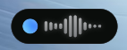

# Typeless

Диктовка в любое поле ввода Windows по горячей клавише — в духе [Aqua Voice](https://aquavoice.com/), но локально и бесплатно.

Нажали **Win+C** (клавиша микрофона на Keychron K8 шлёт именно её) → говорите → слова печатаются в поле,
где стоит курсор, пока вы говорите. Ещё раз **Win+C** — стоп. Copilot при этом не открывается.



## Возможности

- Глобальная горячая клавиша (по умолчанию Win+C, меняется в настройках) — перехват через низкоуровневый хук.
- Два движка:
  - **Whisper (локально)** — `faster-whisper` на CPU, живой ввод: слово печатается, когда два прохода
    распознавания с ним согласны (LocalAgreement). Задержка ≈1–1.5 с на модели `base`.
  - **Диктовка Windows** — приложение нажимает Win+H за вас; работает встроенная диктовка Microsoft (облако).
- Оверлей-«таблетка» с волной и живым текстом: новые слова выезжают снизу, старые строки бледнеют.
- Словарь терминов (Kubernetes, README…) подсказывает Whisper написание английских слов.
- Иконка в трее, окно настроек, автозапуск с Windows.

## Установка

Нужен Python 3.12 (на 3.14 у части зависимостей пока нет сборок).

```powershell
conda create -p .venv python=3.12 -y      # или: py -3.12 -m venv .venv
.\.venv\python.exe -m pip install -r requirements.txt
.\.venv\python.exe -m typeless            # с консолью и логом
# или без консоли:
.\.venv\pythonw.exe run.pyw
```

При первом запуске скачивается модель Whisper (`base` ≈ 145 МБ) в кэш Hugging Face.

Настройки: двойной клик по иконке в трее или «Настройки…» в её меню.
Конфиг и лог: `%APPDATA%\typeless\`.

## Ограничения

- В окна, запущенные **от администратора**, Windows не пропускает ввод от обычного процесса.
  Если нужно печатать туда — запустите Typeless тоже от администратора.
- Если во время диктовки переключиться в другое окно, печать прекращается, а остаток текста
  попадает в буфер обмена.
- Скорость на CPU (i5-13420H): `base` ≈0.8 с на проход, `small` ≈2.5 с (лаг ≈5 с).

## Разработка

```powershell
.\.venv\python.exe -m pytest                                  # юнит-тесты
.\.venv\python.exe scripts\bench.py speech.wav base small     # скорость моделей
.\.venv\python.exe scripts\simulate_stream.py speech.wav      # живой режим на WAV-файле
.\.venv\python.exe scripts\render_overlay.py overlay.png      # картинка оверлея
```

Дизайн: [docs/superpowers/specs/2026-10-06-typeless-design.md](docs/superpowers/specs/2026-10-06-typeless-design.md).
